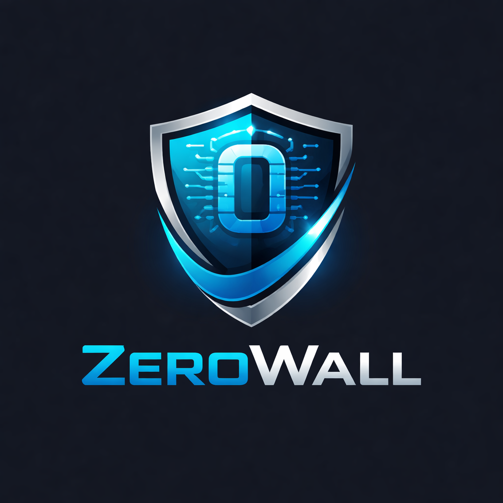

  

<h1 align="center">ZeroWall</h1>

  <strong>Enterprise-grade, open-source firewall and security gateway built on FreeBSD.</strong>

  
  
  

---

## What is ZeroWall?

**ZeroWall** is a high-performance network operating system purpose-built for firewall and gateway roles. It transforms commodity x86 hardware or virtual machines into a hardened, feature-rich security appliance capable of protecting networks of any size — from small home labs to multi-site enterprise deployments.

Built on the rock-solid **FreeBSD 14.x** foundation, ZeroWall combines the industry-standard **pf** packet filter with a modern, responsive **React-based dashboard** and a powerful **REST API**.

## Key Features

- 🛡️ **Stateful Packet Inspection (pf):** Advanced connection tracking for IPv4 and IPv6.
- 🚀 **High Performance VPN:** Native WireGuard and OpenVPN site-to-site/road-warrior support.
- 🔍 **Intrusion Prevention (IDS/IPS):** Deep Packet Inspection powered by Suricata.
- ⚖️ **Traffic Shaping (QoS):** Granular bandwidth control and prioritization.
- 🔄 **High Availability (CARP):** Active/Passive failover with state synchronization.
- 🌐 **Network Services:** Integrated Unbound DNS, DHCP server, and Dynamic DNS.
- 📊 **Real-Time Telemetry:** Live traffic graphs and log streaming via WebSockets.

---

## 📚 Documentation

The ZeroWall documentation is organized into a sequential technical reference.

### Core Documentation
1.  [**Project Overview**](docs/01-overview.md) — What is ZeroWall and why we built it.
2.  [**Features**](docs/02-features.md) — Detailed breakdown of core capabilities.
3.  [**Firewall Engine**](docs/03-firewall-engine.md) — Deep dive into the `pf` implementation.
4.  [**System Architecture**](docs/04-system-architecture.md) — Layered design and component interactions.
5.  [**Network Flow**](docs/05-network-flow.md) — Logical topologies and packet paths.
6.  [**Modules**](docs/06-modules.md) — Overview of the plugin and component system.
7.  [**Security Model**](docs/07-security-model.md) — Privilege separation and hardening.

### Technical Reference
8.  [**VPN System**](docs/08-vpn-system.md) — WireGuard, OpenVPN, and IPsec configuration.
9.  [**Web Dashboard**](docs/09-web-dashboard.md) — Guide to the management interface.
10. [**API Design**](docs/10-api-design.md) — REST API and WebSocket reference.
11. [**Database Design**](docs/11-database-design.md) — Configuration and logging architecture.

### Guides
12. [**Installation Guide**](docs/12-installation-guide.md) — Physical and virtual deployment.
13. [**Configuration Guide**](docs/13-configration-guide.md) — Advanced system tuning.
14. [**Developer Guide**](docs/14-developer-guide.md) — Contributing to the core and building plugins.

---

## 🚀 Quick Start

To get a minimal ZeroWall instance running in a virtual environment:

1.  Download the latest ISO image.
2.  Create a VM with at least 2GB RAM and 2 NICs (WAN and LAN).
3.  Boot from the ISO and run the installer.
4.  Assign your interfaces via the console menu.
5.  Access the web dashboard at `https://192.168.1.1` (login: `admin` / `zerowall`).

For detailed instructions, see the [Installation Guide](docs/12-installation-guide.md).

---

## 🤝 Contributing

We welcome contributions of all kinds! Whether you're fixing a bug, adding a feature, or improving documentation, please see our [CONTRIBUTING.md](CONTRIBUTING.md) to get started.

- **Found a bug?** Open an [Issue](https://github.com/boniyeamincse/ZeroWall/issues).
- **Have a fix?** Submit a Pull Request.
- **Security concerns?** Please refer to our [Security Policy](SECURITY.md).

---

## 📄 License

ZeroWall is released under the **MIT License**. See [LICENSE](LICENSE) for full details.
